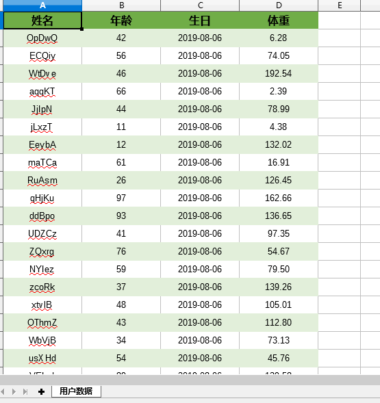

# mgical-excel

> 基于注解的Excel导入导出开源组件


[](https://www.codacy.com/manual/otary/magical-excel?utm_source=github.com&amp;utm_medium=referral&amp;utm_content=otary/magical-excel&amp;utm_campaign=Badge_Grade)
[](https://travis-ci.org/otary/magical-excel)
[](https://codecov.io/gh/otary/magical-excel)

## 功能

- [x] 基于注解导入/导出
- [x] 可自定义复合头部
- [x] 可自定义单元格样式
- [x] 单双行斑马线
- [x] sheet分页(指定每页行数，自动分页)
- [x] 多sheet页导入/导出（每个sheet页都映射到entity中）
- [x] 支持值转换（excel单元格中的值转换后写入entity对象中）
- [x] 支持数据校验
- [ ] 动态字段导入/导出(后续开发...)


## 优势

- 基于事件驱动模型加载数据（非一次性加载），有效解决了大数据量JVM OutOfMemory风险
- 扩展性良好，支持自定义转换器（ExcelConverter）、自定义单元格构建器、数据校验等

## 编译

> $ mvn package 


## 性能测试

> $ java -verbose:gc -jar magical-excel-1.0.4-execute.jar

- 1000条导入/导出测试

```
【构建数据】 - 耗时:31 ms
【构建数据】 - 耗费内存:2 MB

// 导出
[GC (Allocation Failure)  65024K->10054K(249344K), 0.0059588 secs]
【导出excel】 - 耗时:1817 ms
【导出excel】 - 耗费内存:56 MB

// 导入
[GC (Allocation Failure)  75078K->8051K(249344K), 0.0052075 secs]
成功读取:1000条数据
【导入excel】 - 耗时:200 ms
【导入excel】 - 耗费内存:10 MB
```

- 1w条导入/导出测试

```
【构建数据】 - 耗时:48 ms
【构建数据】 - 耗费内存:8 MB

// 导出
[GC (Allocation Failure)  65024K->11367K(249344K), 0.0071728 secs]
[GC (Allocation Failure)  76391K->7657K(249344K), 0.0041991 secs]
【导出excel】 - 耗时:2109 ms
【导出excel】 - 耗费内存:22 MB

// 导入
[GC (Allocation Failure)  72681K->13947K(249344K), 0.0059574 secs]
[GC (Allocation Failure)  78971K->12546K(249344K), 0.0038263 secs]
成功读取:10000条数据
【导入excel】 - 耗时:475 ms
【导入excel】 - 耗费内存:5 MB

```

- 10w条导入/导出测试

```` 
[GC (Allocation Failure)  65024K->12929K(249344K), 0.0069220 secs]
【构建数据】 - 耗时:125 ms
【构建数据】 - 耗费内存:26 MB

// 导出
[GC (Allocation Failure)  77953K->24807K(314368K), 0.0111501 secs]
[GC (Allocation Failure)  154855K->24871K(314368K), 0.0053166 secs]
[GC (Allocation Failure)  154919K->24895K(444416K), 0.0047846 secs]
【导出excel】 - 耗时:3797 ms
【导出excel】 - 耗费内存:115 MB

// 导入
[GC (Allocation Failure)  284991K->78395K(444416K), 0.0216862 secs]
[GC (Allocation Failure)  338491K->81980K(744960K), 0.0056511 secs]
[GC (Allocation Failure)  602172K->90191K(747520K), 0.0104360 secs]
成功读取:100000条数据
【导入excel】 - 耗时:1673 ms
【导入excel】 - 耗费内存:143 MB
```` 

- 100w条导入/导出测试

```
[GC (Allocation Failure)  65024K->12913K(249344K), 0.0062516 secs]
[GC (Allocation Failure)  77571K->25745K(314368K), 0.0105911 secs]
[GC (Allocation Failure)  155793K->54007K(314368K), 0.0205887 secs]
[GC (Allocation Failure)  184055K->82182K(444416K), 0.0182219 secs]
[GC (Allocation Failure)  342278K->138916K(444416K), 0.0348634 secs]
[Full GC (Ergonomics)  138916K->137971K(584192K), 1.2659738 secs]
【构建数据】 - 耗时:1677 ms
【构建数据】 - 耗费内存:215 MB

// 导出
[GC (Allocation Failure)  398067K->162736K(654848K), 0.0222590 secs]
[GC (Allocation Failure)  479152K->158867K(706048K), 0.0209800 secs]
[GC (Allocation Failure)  530579K->158913K(766464K), 0.0203646 secs]
[GC (Allocation Failure)  582337K->158940K(802816K), 0.0200972 secs]
[GC (Allocation Failure)  582364K->158930K(814592K), 0.0190477 secs]
[GC (Allocation Failure)  604882K->158906K(821760K), 0.0190643 secs]
[GC (Allocation Failure)  604858K->158993K(827392K), 0.0187473 secs]
[GC (Allocation Failure)  620305K->158970K(833024K), 0.0193465 secs]
【导出excel】 - 耗时:21422 ms
【导出excel】 - 耗费内存:188 MB

// 导入
[GC (Allocation Failure)  567782K->246058K(837120K), 0.0307607 secs]
[GC (Allocation Failure)  975146K->993392K(1625088K), 0.1334081 secs]
[Full GC (Ergonomics)  993392K->318986K(1312256K), 0.0612114 secs]
[GC (Allocation Failure)  785930K->326124K(1337344K), 0.0045763 secs]
[GC (Allocation Failure)  820204K->333787K(1337344K), 0.0075318 secs]
[GC (Allocation Failure)  827867K->341452K(1348096K), 0.0098278 secs]
[GC (Allocation Failure)  856012K->349484K(1353728K), 0.0111301 secs]
[GC (Allocation Failure)  864044K->357737K(1369088K), 0.0157139 secs]
[GC (Allocation Failure)  889193K->365809K(1371136K), 0.0158831 secs]
[GC (Allocation Failure)  897265K->373817K(1388032K), 0.0220361 secs]
[GC (Allocation Failure)  918073K->382777K(1394176K), 0.0214158 secs]
[GC (Allocation Failure)  927033K->391009K(1413632K), 0.0251566 secs]
[GC (Allocation Failure)  946529K->399393K(1423360K), 0.0255940 secs]
[GC (Allocation Failure)  954913K->408864K(1440256K), 0.0321049 secs]
[GC (Allocation Failure)  970528K->417312K(1452032K), 0.0304051 secs]
[GC (Allocation Failure)  978976K->425832K(1472000K), 0.0357320 secs]
[GC (Allocation Failure)  994664K->434504K(1485312K), 0.0355730 secs]
[GC (Allocation Failure)  1003336K->444566K(1507328K), 0.0418913 secs]
[GC (Allocation Failure)  1022102K->453334K(1521664K), 0.0416292 secs]
[GC (Allocation Failure)  1030870K->462174K(1550848K), 0.0436933 secs]
[GC (Allocation Failure)  1056606K->471238K(1560576K), 0.0435337 secs]
成功读取:1000000条数据
【导入excel】 - 耗时:10665 ms
【导入excel】 - 耗费内存:155 MB

```


## 环境配置

### maven配置

```` xml
<dependency>
	<groupId>cn.chenzw.excel</groupId>
    <artifactId>magical-excel</artifactId>
    <version>1.0</version>
</dependency>
````


### 依赖

```` xml
<dependency>
    <groupId>org.apache.poi</groupId>
    <artifactId>poi</artifactId>
    <version>3.17</version>
</dependency>
<dependency>
    <groupId>org.apache.poi</groupId>
    <artifactId>poi-ooxml</artifactId>
    <version>3.17</version>
</dependency>
<dependency>
    <groupId>org.apache.commons</groupId>
    <artifactId>commons-lang3</artifactId>
    <version>3.5</version>
</dependency>
<dependency>
    <groupId>cn.chenzw.excel</groupId>
    <artifactId>magical-excel</artifactId>
    <version>1.0</version>
</dependency>
 ````
 
---
  
## 核心注解

### 导出

**@ExcelExport**：注解于类上，标注Sheet页数据
  + order:sheet页顺序（值越小，越靠前）
  + sheetName：Sheet页名称，默认值: "数据"
  + maxRowsPerSheet：每个Sheet页允许的最大条数（超过将进行分Sheet）
  + rowStriped: 是否条纹显示，默认值: true
  + rowStripeColor: 条纹颜色, 默认值: "E2EFDA"（浅绿色）
  + titleRowHeight: 标题行高度, 默认值: 20
  + dataRowHeight：数据行高度, 默认值: 20

**@ExcelExportColumn**：注解于字段上
  + title：标题
  + colIndex:列索引（起始值:1）
  + cellType:列类型（默认:String）
	  + CellType.NUMERIC
	  + CellType.STRING
	  + CellType.FORMULA：公式
	  + BLANK
	  + BOOLEAN
	  + ERROR
  + dataFormat：数据格式
  + titleCellStyleBuilder：标题样式, 默认: DefaultDataCellStyleBuilder.class
  + dataCellStyleBuilder：数据样式, 默认: DefaultTitleCellStyleBuilder.class
  + autoWidth：是否自动调整宽度（默认:false）
  + colWidth:自定义cell宽度（默认:16）

eg. 
``` java
@ExcelExport(sheetName = "用户数据")
public class User {

    @ExcelExportColumn(colIndex = 1, title = "姓名")
    private String name;

    @ExcelExportColumn(colIndex = 2, title = "年龄")
    private Integer age;

    @ExcelExportColumn(colIndex = 3, title = "生日", dataFormat = @ExcelDataFormat("yyyy-MM-dd"))
    private Date birth;

    @ExcelExportColumn(colIndex = 4, title = "体重", dataFormat = @ExcelDataFormat("0.00"))
    private Double height;
}
```

### 导入

**@ExcelImport**：
  + sheetIndex：绑定的sheet页（可多个）
  + firstDataRow：起始数据行（默认值:2）

**@ExcelImportColumn**：
  + colIndex：列索引（起始值:1）
  + allowBlank:是否允许为空（默认: true）
  + dateFormat：日期格式

### 值转换

**@ExcelKVConvert**: 用于将excel中读取的值转换后放入entity对象中
  - kvmap: 键值对, 格式: key=value（String[]）
  - allowMissHit: 是否允许未匹配的值(默认: false)

eg. 
``` java
@ExcelExport(sheetName = "节假日")
public class HolidayCfg {

    // Excel中读取到的值("是"、"否")转换成（0、1）
    @ExcelKVConvert(kvmap = {"是=0", "否=1"})
    @ExcelExportColumn(title = "是否上班", colIndex = 3)
    private String isWork;
    
    ....
｝
```

### 复合头

**@ExcelComplexHeader**: 
  - value: 指定Cell访问
  

```` java

@ExcelComplexHeader({
        @CellRange(firstCol = 1, lastCol = 4, firstRow = 1, lastRow = 2, title = "用户数据", cellStyleBuilder = LightGreenTitleCellStyleBuilder.class),
        @CellRange(firstRow = 3, lastRow = 3, firstCol = 1, lastCol = 2, title = "基本信息", cellStyleBuilder = LightGreenTitleCellStyleBuilder.class),
        @CellRange(firstRow = 3, lastRow = 3, firstCol = 3, lastCol = 4, title = "扩展信息", cellStyleBuilder = LightGreenTitleCellStyleBuilder.class)})
@ExcelExport(sheetName = "用户数据")
public class UserComplexHeader {
    ....
}

````

### 值校验

**@ExcelStringList**
  - value(String[]): 指定允许的值列表（不在列表的值则抛出异常）
  
**@ExcelRegexValue**
  - regex: 使用正则匹配值（值不匹配则抛出异常）
  - message: 抛出的异常文本

## 功能示例

### 模版导出

``` java
// 单sheet模版
try (FileOutputStream fos = new FileOutputStream(new File("template_by_model.xlsx"))) {
   ExcelWriter.newTemplateInstance(HolidayCfg.class).write(fos);
} catch (IOException e) {
   e.printStackTrace();
}

// 多Sheet模版
try (FileOutputStream fos = new FileOutputStream(new File("template_by_models.xlsx"))) {
   ExcelWriter.newTemplateInstance(HolidayCfg.class, User.class).write(fos);
} catch (IOException e) {
   e.printStackTrace();
}

````

```` java
import cn.chenzw.excel.magic.core.meta.annotation.*;
import cn.chenzw.excel.magic.core.meta.annotation.converter.ExcelKVConvert;
import cn.chenzw.excel.magic.core.meta.annotation.datavalidation.ExcelStringList;

import java.util.Date;

@ExcelExport(sheetName = "节假日")
public class HolidayCfg {

    @ExcelExportColumn(title = "节假日日期", colIndex = 1, dataFormat = @ExcelDataFormat("yyyy-MM-dd HH:mm:ss"))
    private Date holidayDate;

    @ExcelExportColumn(title = "节假日名称", colIndex = 2)
    private String holidayName;

    @ExcelKVConvert(kvmap = {"是=0", "否=1"})
    @ExcelExportColumn(title = "是否上班", colIndex = 3)
    private String isWork;

    @ExcelExportColumn(title = "备注", colIndex = 4)
    private String remark;
    
    ....
｝

@ExcelExport(sheetName = "用户数据")
public class User {

    @ExcelExportColumn(colIndex = 1, title = "姓名")
    private String name;

    @ExcelExportColumn(colIndex = 2, title = "年龄")
    private Integer age;

    @ExcelExportColumn(colIndex = 3, title = "生日", dataFormat = @ExcelDataFormat("yyyy-MM-dd"))
    private Date birth;

    @ExcelExportColumn(colIndex = 4, title = "体重", dataFormat = @ExcelDataFormat("0.00"))
    private Double height;

    ....
}
````


### 数据导出(基础)

```` java
// 单Sheet数据导出
try (FileOutputStream fos = new FileOutputStream(new File("single_sheet_data.xlsx"))) {
    ExcelWriter.newInstance().addData(users).write(fos);
} catch (IOException e) {
    e.printStackTrace();
}

// 多Sheet数据导出
try (FileOutputStream fos = new FileOutputStream(new File("multi_sheet_data.xlsx"))) {
    ExcelWriter.newInstance().addData(users).addData(holidayCfgs).write(fos);
    //ExcelWriter.newInstance().addData(users, holidayCfgs).write(fos);
} catch (IOException e) {
    e.printStackTrace();
}

````


### Sheet分页

```` java
// 每个Sheet页50条数据
@ExcelExport(sheetName = "用户数据", maxRowsPerSheet = 50)
public class UserPaging {
    
    ...
}
````


### 自定义单元格样式

```` java
@ExcelExport(sheetName = "用户数据", rowStriped = true, rowStripeColor = "E2EFDA")
public class UserStyle {

    @ExcelExportColumn(colIndex = 1, title = "姓名", titleCellStyleBuilder = LightGreenTitleCellStyleBuilder.class)
    private String name;

    @ExcelExportColumn(colIndex = 2, title = "年龄", titleCellStyleBuilder = LightGreenTitleCellStyleBuilder.class)
    private Integer age;

    @ExcelExportColumn(colIndex = 3, title = "生日", dataFormat = @ExcelDataFormat("yyyy-MM-dd"), titleCellStyleBuilder = LightGreenTitleCellStyleBuilder.class)
    private Date birth;

    @ExcelExportColumn(colIndex = 4, title = "体重", dataFormat = @ExcelDataFormat("0.00"), titleCellStyleBuilder = LightGreenTitleCellStyleBuilder.class)
    private Double height;

    ....
}

````



### 自定义行高、列宽

```` java
// 指定标题行高度、数据行高度
@ExcelExport(sheetName = "用户数据", titleRowHeight = 25, dataRowHeight = 20)
public class UserWH {

    // 自动宽度
    @ExcelExportColumn(colIndex = 1, title = "姓名", autoWidth = true)
    private String name;

    // 指定宽度
    @ExcelExportColumn(colIndex = 2, title = "年龄", colWidth = 20)
    private Integer age;

    ....
｝

````


### 自定义复杂表头

```` java
@ExcelComplexHeader({
        @CellRange(firstCol = 1, lastCol = 4, firstRow = 1, lastRow = 2, title = "用户数据", cellStyleBuilder = LightGreenTitleCellStyleBuilder.class),
        @CellRange(firstRow = 3, lastRow = 3, firstCol = 1, lastCol = 2, title = "基本信息", cellStyleBuilder = LightGreenTitleCellStyleBuilder.class),
        @CellRange(firstRow = 3, lastRow = 3, firstCol = 3, lastCol = 4, title = "扩展信息", cellStyleBuilder = LightGreenTitleCellStyleBuilder.class)})
@ExcelExport(sheetName = "用户数据")
public class UserComplexHeader {
    ....
}

````

----
### 导入

```` java
InputStream is = Thread.currentThread().getContextClassLoader().getResourceAsStream("test.xlsx");
ExcelReader excelReader = new ExcelReader(is);
List<HolidayCfg> holidayCfgs = excelReader.read(HolidayCfg.class);
````

```` java
@ExcelImport(sheetIndex = 1, firstDataRow = 2)
public class HolidayCfg {

    @ExcelImportColumn(colIndex = 1, dateFormat = "yyyy-MM-dd", allowBlank = false)
    private Date holidayDate;

    @ExcelImportColumn(colIndex = 2, allowBlank = false)
    private String holidayName;

    @ExcelKVConvert(kvmap = {"是=0", "否=1"})
    @ExcelImportColumn(colIndex = 3, allowBlank = false)
    private String isWork;

    @ExcelImportColumn(colIndex = 4)
    private String remark;
   
    ....
}

````

